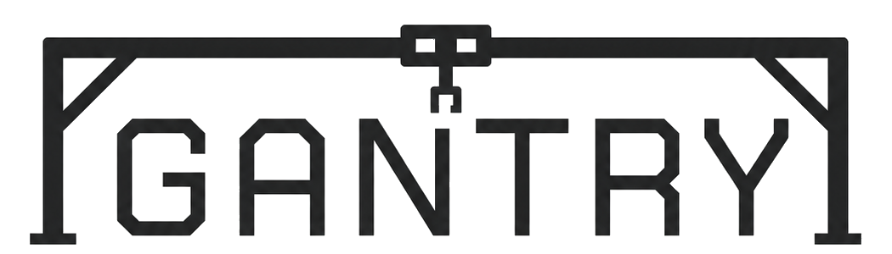

<div align="center">
<p align="center">
  <picture>
    <source
      srcset="./resources/gantry-light.png"
      media="(prefers-color-scheme: dark)"
    />
    <source
      srcset="./resources/gantry-dark.png"
      media="(prefers-color-scheme: light)"
    />
    
  </picture>
</p>
<p align="center">
  <a href="https://github.com/NFJones/gantry/stargazers"></a>
  <a href="https://github.com/NFJones/gantry/forks"></a>
  <a href="https://github.com/NFJones/gantry/issues"></a>
  <a href="https://github.com/NFJones/gantry/actions"></a>
</p>
</div>

***

Gantry is a language for orchestrating model-backed agents and
typed host capabilities. It makes the work that crosses an agent integration
boundary explicit, so an agent workflow can be read, reviewed, validated, and
run with clear control-flow and recovery semantics.

A Gantry program uses ordinary typed expressions for deterministic work and
three visible operations for agent integration-backed work:

- `prompt` asks a selected agent to produce a value that satisfies a declared
  type.
- `decide` asks an agent for a structured judgment that can guide control
  flow.
- `action` invokes a typed capability supplied by the embedding harness.

Packages also provide typed structs, enums, options, results, modules,
workflows, pattern routing, loops, sessions, and structured parallel work.
`spawn` creates a child task; every task is visibly consumed with `join`,
`joinall()`, or `detach`.

## Example

This complete package researches a topic through a harness action, asks a
research agent to draft a brief, and lets an editor revise it when a model
judgment calls for revision:

```rust
struct Brief {
    title: String,
    summary: String,
}

agents { researcher, editor }
default agent = researcher;

action read_only search(topic: String) -> List<String>;

fn main(topic: String) -> Brief {
    let sources: List<String> = action search(topic);
    let brief: Brief = prompt "Write a concise brief about ${topic}."
        using { sources }
        -> Brief;

    if decide "Does this brief need editorial revision?" using { brief } {
        return with editor {
            prompt "Revise this brief for clarity." using { brief } -> Brief
        };
    }

    brief
}
```

The `action`, `prompt`, and `decide` sites are the only integration requests.
Bindings, branching, and the `with editor` scope are deterministic Gantry
orchestration. An embedding maps `researcher` and `editor` to its agents and
implements the declared `search` capability.

## Language model

Gantry separates portable source semantics from embedding-specific policy.
The language defines package validation, typed structured output, operation
retries and failure handling, agent and session context, cancellation,
concurrency, durability, resume, and observation. The embedding supplies
models, tools, credentials, transports, resource policies, persistence, and
event delivery.

Conformance is profile-based: frontend, analyzer, evaluator,
concurrent-evaluator, durable-runtime, and embedding profiles describe which
parts of the contract an implementation or integration provides. This lets a
deployment make precise capability claims without changing source meaning.

This revision advertises the frontend and analyzer profiles when analysis is
compiled. Evaluator, concurrent-evaluator, durable-runtime, and embedding
claims remain gated by their later conformance closeouts.

## Getting started

Create a package directory with a `main.gnt` entry point, then check it with
the command-line tool:

```sh
just run -- check [PACKAGE_ROOT]
```

`PACKAGE_ROOT` defaults to the current directory. The command prints
`syntax-valid` when its source is syntactically valid; otherwise it reports
diagnostics, prints `syntax-invalid`, and exits with status 1.

Run complete semantic analysis in concise text mode or deterministic
machine-readable mode:

```sh
just run -- analyze [PACKAGE_ROOT]
just run -- analyze --json [PACKAGE_ROOT]
```

The JSON form emits `gantry.analysis/v1` with structured diagnostics and, for
source-valid packages, the canonical package manifest, analysis IR, source
map, concrete schemas, generic substitutions, selected calls, exact effects,
source origins, and closed executable projection. Operational failures remain
separate from source-invalid results.

For repository development:

```sh
just check
just test
```

Run `just help` to list all development commands.

## Documentation

- [`SPEC.md`](SPEC.md) is the normative Gantry language, execution, and
  embedding contract. Start with Sections 1.1 and 1.2, then use Section 14 for
  focused authoring examples.
- [`docs/`](docs/README.md) indexes language, user, and contributor
  documentation.
- [`AGENTS.md`](AGENTS.md) describes repository workflow and contribution
  requirements.

## Rust library packages

The supported Rust library is published as a version-locked package set rather
than as one archive containing private path dependencies. The public set is
`gantry`, `gantry-core`, `gantry-frontend`, `gantry-host`, `gantry-ir`,
`gantry-observe`, `gantry-analysis`, `gantry-runtime`,
`gantry-adapter-tokio`, and `gantry-storage-sqlite`. All members use the same
release version, and the facade's feature graph selects the required members.

Before registry publication, `just package-check` assembles every normalized
Cargo source archive and verifies the complete set together through local
registry patches. Registry publication follows dependency order: core first;
frontend, host, and IR next; observation, analysis, and adapters after their
dependencies; runtime after observation; and the `gantry` facade last. The
CLI, conformance harness, and repository tooling remain source-only packages.
- [`protocol/`](protocol/README.md) contains versioned protocol inputs,
  schemas, generated bindings, and conformance material.

## License

Gantry is licensed under the [Apache License 2.0](COPYING).
