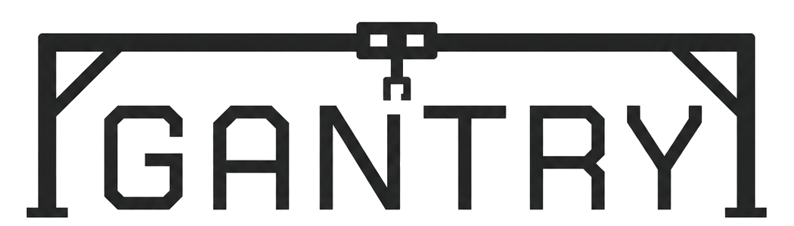

<div align="center">
<p align="center">
  <picture>
    <source
      srcset="./resources/gantry-light.png"
      media="(prefers-color-scheme: dark)"
    />
    <source
      srcset="./resources/gantry-dark.png"
      media="(prefers-color-scheme: light)"
    />
    
  </picture>
</p>
<p align="center">
  <a href="https://github.com/NFJones/gantry/stargazers"></a>
  <a href="https://github.com/NFJones/gantry/forks"></a>
  <a href="https://github.com/NFJones/gantry/issues"></a>
  <a href="https://github.com/NFJones/gantry/actions"></a>
</p>
</div>

***

Gantry is a typed language for orchestrating model-backed agents and
host-provided tools. It makes model requests, tool calls, and ordinary control
flow explicit, so workflows can be read, reviewed, and validated before
execution rather than hidden inside ad hoc integration code.

This repository contains the language specification, a Rust implementation,
a command-line tool, and a library for embedding Gantry in a host application.
Workflow authors describe the work; application developers supply the models,
tools, and credentials through the host.

A Gantry program combines ordinary typed expressions with three visible
integration operations:

- `prompt` asks a selected agent to produce a value that satisfies a declared
  type.
- `decide` asks an agent for a structured judgment that can guide control
  flow.
- `action` invokes a typed capability supplied by the host.

## Status

Gantry v1 is not yet declared stable; the language and embedding contracts may
still change. The implementation supports source validation, semantic
analysis, sequential and concurrent execution, and durable recovery through
the Rust library. The CLI provides checking, analysis, and deterministic
execution, but does not configure model or tool integrations.

The current release is qualified on Linux. Hosted macOS validation and
SQLite power-loss durability are not claimed. See the
[release qualifications](docs/async-execution-release.md) for the exact scope
and the [general-purpose implementation effort](docs/general-purpose-preregistration.md)
for remaining evidence requirements.

## Example

This package searches for sources, asks a research agent to draft a typed
brief, and lets an editor revise it when a model judgment calls for revision:

```rust
struct Brief {
    title: String,
    summary: String,
}

agents { researcher, editor }
default agent = researcher;

action read_only search(topic: String) -> List<String>;

fn main(topic: String) -> Brief {
    let sources: List<String> = action search(topic);
    let brief: Brief = prompt "Write a concise brief about ${topic}."
        using { sources }
        -> Brief;

    if decide "Does this brief need editorial revision?" using { brief } {
        return with editor {
            prompt "Revise this brief for clarity." using { brief } -> Brief
        };
    }

    brief
}
```

Only `action`, `prompt`, and `decide` request integration work. Bindings,
branching, and the `with editor` scope are deterministic orchestration.
Executing this example requires a host application that supplies the `topic`
input, maps `researcher` and `editor` to agents, and implements `search`.
It is not a standalone CLI demo.

## Getting started

### Set up a source checkout

Install Git, [Rust through rustup](https://rustup.rs/), and
[`just`](https://github.com/casey/just#installation). Rustup uses the pinned
toolchain in `rust-toolchain.toml` automatically inside the checkout; the
workspace's minimum supported Rust version is 1.91.

```sh
git clone https://github.com/NFJones/gantry.git
cd gantry
```

### Check and run a package

Try the checked-in [generics and traits package](examples/generics-and-traits/main.gnt).
It needs no model credentials or tool bindings:

```sh
just run check examples/generics-and-traits
just run analyze examples/generics-and-traits
just run run examples/generics-and-traits
```

The commands build the CLI as needed and print, respectively:

```text
syntax-valid
source-valid
"envelope"
```

- `check` validates source syntax.
- `analyze` checks types and other semantic rules. Add `--json` for structured
  diagnostics and analysis artifacts: `just run analyze --json examples/generics-and-traits`.
- `run` executes the package and prints its result as JSON. The default CLI
  build supports sequential, hook-free execution; agent-backed workflows need
  a host integration, and concurrent execution requires library features.

To write your own package, create a directory containing `main.gnt` and pass
that directory instead of the example path. An omitted package path defaults
to the current directory. Start with the
[minimal entry-point examples](SPEC.md#141-minimal-package-entry-point).

## How Gantry works

Gantry defines the meaning of source programs: typed values, branching,
operation retries and failure handling, agent sessions, cancellation,
concurrency, and recovery. The host application supplies integration policy:
models, tools, credentials, transports, resource limits, persistence, and
event delivery.

The language includes structs, enums, options, results, modules, generics,
traits, and loops. For parallel work, `spawn` creates child tasks that are
explicitly handled with `join`, `joinall()`, or `detach`. Durable execution
adds the ability to resume work under the documented recovery contract.

## Embedding in Rust

The [`gantry` crate](crates/gantry/src/lib.rs) is the supported public Rust
facade. Features select validation, analysis, execution, concurrency, and
durability. An embedding constructs an `Interpreter`, supplies host services
and an executor, and uses execution handles to observe, cancel, or await work.
Gantry does not create a hidden executor runtime inside the library.

See the [embedding interfaces](SPEC.md#15-required-embedding-interfaces) and
[execution integration guide](docs/parallel-execution.md). The library is
packaged as a version-locked crate set; the CLI remains source-only.

## Documentation

**Learn the language**

- [Authoring examples and common errors](SPEC.md#14-authoring-examples-and-common-errors)
- [Generics and traits](docs/generics-and-traits.md)
- [Parallel execution](docs/parallel-execution.md)

**Integrate and operate**

- [Rust facade](crates/gantry/src/lib.rs) and
  [required embedding interfaces](SPEC.md#15-required-embedding-interfaces)
- [CLI runtime policy](docs/cli-runtime-policy.md)
- [Durable recovery](docs/executor-backed-recovery.md) and
  [SQLite storage](docs/sqlite-journal-storage.md)

**Reference and project status**

- [Complete documentation index](docs/README.md)
- [Normative language and runtime specification](SPEC.md)
- [Versioned protocols and conformance material](protocol/README.md)
- [Release qualifications and embedding migration](docs/async-execution-release.md)
- [General-purpose implementation evidence scope](docs/general-purpose-preregistration.md)

## Contributing

Read [AGENTS.md](AGENTS.md) for repository structure, development workflow,
and contribution requirements. Useful commands from the repository root are:

```sh
just check
just fmt
just clippy
timeout 120s just test
```

Run `just help` to list all recipes, including `just package-check` for library
packaging validation. Report bugs or propose improvements through
[GitHub issues](https://github.com/NFJones/gantry/issues); include a small
reproducing package and the command and diagnostics when reporting a bug.

## License

Gantry is licensed under the [Apache License 2.0](COPYING).
